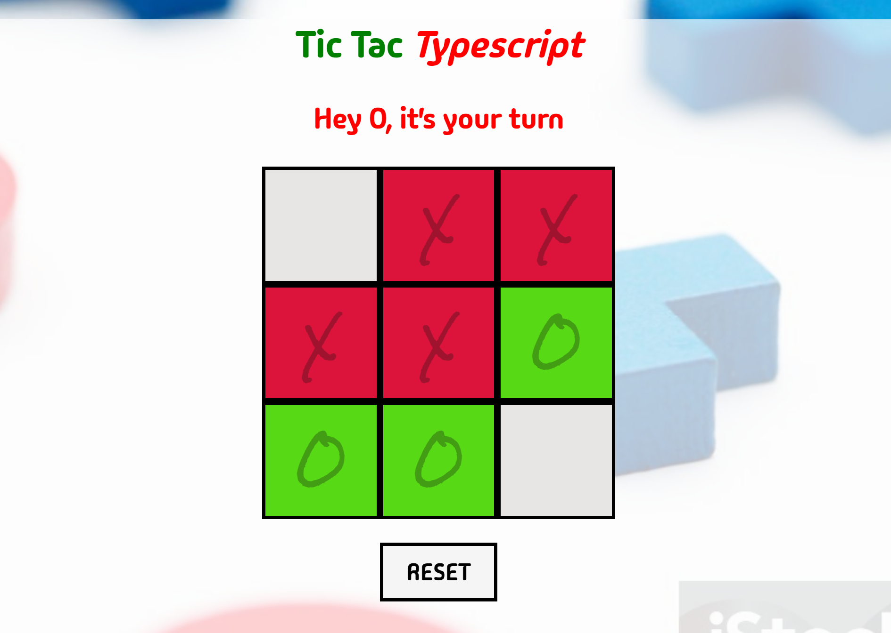

<a id="badges"></a>
[](https://opensource.org/licenses/MIT)

# Tic Tac Typescript

<div align="center">


</div>

I built this Tic Tac Toe game as a hands-on exploration of TypeScript!  
<br>
Leveraging the power of Next.js and React, I dove into the world of static typing and clean code.
<br>
_The result?_ A fun and functional game that solidified my understanding of TypeScript. Take a look and see what you think!

---

## Technologies Used

- Typscript
- Next.js
- React

### Dependencies:

```
"dependencies": {
    "react": "^18",
    "react-dom": "^18",
    "next": "14.1.3"
  },
  "devDependencies": {
    "typescript": "^5",
    "@types/node": "^20",
    "@types/react": "^18",
    "@types/react-dom": "^18"
  }
```

---

## Screenshots




## Credits

Reference Video:

##### [TomDoesTech](https://www.youtube.com/watch?v=7iw8j20h4pc&list=PL41PQx5PPbt6OheJQkg-QNROfx9j75MuR&index=8)

Wallpaper Credit:

##### [Unsplash](https://media.istockphoto.com/id/1515270520/photo/wooden-tic-tac-toe-game.jpg?s=2048x2048&w=is&k=20&c=gQCijlgJqbY-90frYIQH1XGcWs5RkserKQQ92XIRnSM=)

---

## Links

#### [Repo](https://github.com/8BitGinger/tictactoe)

#### [Deployed](https://tictactypscript-5cd5d0597c27.herokuapp.com/)

---

## Questions

[Gmail](mailto:ryan.fann@gmail.com)

[8BitGinger](https://github.com/8BitGinger)

<div align="center">

<a href="https://github.com/8BitGinger">


</a>

</div>
